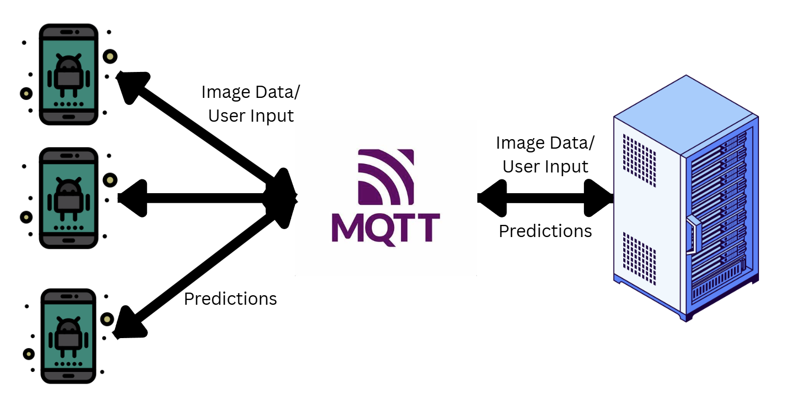

# 🍱 SC4031-Food-Detection

A full-stack IoT system combining an Android mobile app, MQTT messaging, and a server-side AI model for food image classification and localization.

---

## 📖 Overview

**System Components**

- 📱 **Android IoT Devices (Mobile App)**  
  → Captures or uploads food images  
  → Sends images to server via MQTT  
  → Displays predicted food labels + bounding boxes  
  → Allows users to verify or correct labels, and sends feedback back

- 💬 **MQTT Communication Layer**  
  → Manages message passing between many IoT devices and the server concurrently  
  → Enables scalable, lightweight communication

- 🖥️ **Server with AI Model**  
  → Receives images via MQTT  
  → Runs the AI model (`Food Image Classifier`) to classify food + localize bounding boxes  
  → Sends predictions back to the correct IoT device  
  → Stores user-verified feedback for future model updates

---



---

## 📂 Project Structure

- **/SC4031-Food-Detection/**
  - `Food Image Classifier/` # AI model + training notebook + README.md for training method and result
  - `foodDetectionApp/` # Android app source code
  - `server/` # Python UDP server + MQTT handler scripts

---

## 💡 Key Features

✅ IoT-based system using Android + MQTT  
✅ Lightweight server-side food classification + localization  
✅ Supports multiple concurrent users  
✅ User feedback loop for continuous model improvement  
✅ Modular and clean project organization

---

## 🚀 How to Run

### 1️⃣ Prerequisites

- Python ≥ 3.7
- Android Studio installed
- MQTT broker (default: `broker.hivemq.com`)

---

### 2️⃣ Run the Server

```bash
cd server/
python -m venv venv           # Create virtual environment
source venv/bin/activate      # On Linux/macOS
venv\Scripts\activate         # On Windows
pip install -r requirements.txt
python server.py        # Start MQTT + UDP server
```

### 3️⃣ Run the Android App

- Open foodDetectionApp/ in Android Studio
- Connect an emulator or physical Android device
- Build and run the app

# On the app:

- Capture or upload food images
- View predictions
- Correct predictions if needed

## 🏗️ Notes

- The system is designed to handle multiple concurrent users over MQTT.
- User feedback is stored and can be used for future model retraining.
- The AI model is fine-tuned using MobileNetV2; details can be found in the `Food Image Classifier` folder.
